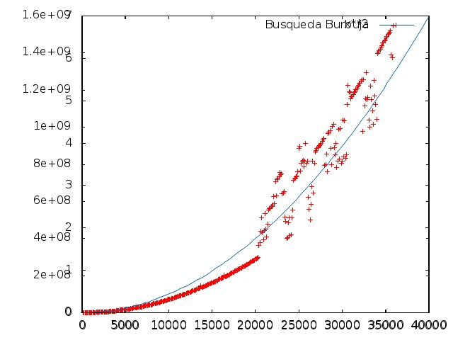

Informe de Eficiencia 1
-----------------------

###Algoritmo de ordenación Burbuja

######Hardware Usado

El equipo donde se ha realizado la compilación y ejecución del programa es un Portatil Acer Aspire 5920 con las siguientes características:

* Procesador de doble núcleo: Intel(R) Core(TM)2 Duo CPU T5450 a 1.66GHz
* 4GB de Ram

######Sistema Operativo

Ubuntu 12.04.4 LTS  32 bits

######Compilador utilizado y opciónes de compilación

Se ha usado gcc versión 4.6.3 (Ubuntu/Linaro 4.6.3-1ubuntu5) 


######Desarrollo completo del cálculo de la eficiencia teórica y gráfica


Para calcular la eficiencia teórica realizamos el cálculo de las operaciones elementales que hay dentro del código principal del algoritmo de ordenación Burbuja.

```sh
void ordenar(int *v, int n){
	for(int i=0; i<n-1; i++)
    	for(int j=0; j<n-i-1; j++)
        	if(v[j]>v[j+1]){
            	int aux = v[j];
                v[j]=v[j+1];
                v[j+1]=aux;
            }
}
```
Haciendo el calculo de forma simplificada y quedandonos con el orden podemos decir que este algoritmo tiene una eficiencia de 0(n^2), cuadrática, una función tal que así:

![Imagen 1][1]  ![Imagen 2][2]

 [1]: graficaxCuadrado.jpeg
 [2]: graficaSalida.jpeg 



######Parámetros usados para el cálculo de la eficiencia empírica y gráfica

######Ajuste de curva teórica a la empírica: mostrar resultados del ajuste y gráfica


#####Detalles:

En linux para conocer el modelo de nuestra CPU además de otros muchos datos de los núcleos de la misma podemos ejecutar: `cat /cpu/info` . 

Para conocer la versión del S.O. `cat /etc/issue` y para conocer la arquitectura (32 o 64 bits) `uname -m` donde veremos x86_64 para 64 bits e i686 para las de 32. 

Para conocer la versión de nuestro compilador  podemos hacer `g++ -v` .

El script que nos dan de ejemplo está estrico en C-Shell (csh), cuya sintaxis es similar a C, estos ficheros no pueden ejecutarse bajo bash (el shell por defecto de Ubuntu) y por tanto tendremos que instalarlo si queremos ejecutarlo `sudo apt-get install csh` .

Para la creación de las gráficas con gnuplot usamos los script .gp asi: `gnuplot ordenacionBurbuja.gp`, que en este caso nos dejará la gráfica en jpeg donde se haya ejcutado gnuplot.


