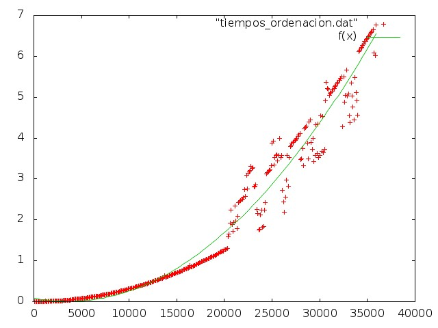
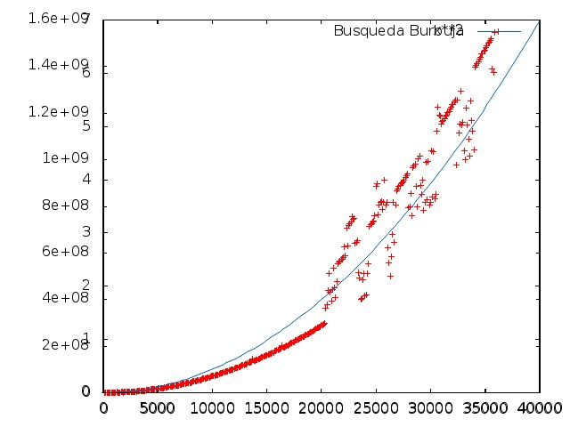

Informe de eficiencia 2
========================
###Ajuste de la ordenación de la burbuja

En el ejercicio anterior vimos como obtener las gráficas tanto de la función que corresponde al orden del algoritmo como de los datos que el algoritmo generó. 

Superponer estas dos funciones parece que es la única forma de ver como se ajusta el resultado empírico al teórico pero gnuplot nos puede ayudar a esto de forma muy sencilla.

Lo único que tenemos que hacer es definir la función que corresponde al orden, en nuestro caso O(n²) y después asignare un fichero de datos para que realice el ajuste, así:

```sh
f(x)=a*x**2 + b*x + c
fit f(x) "tiempos_ordenacion.dat" via a, b, c, d
set terminal jpeg
set output "graficaAjuste.jpeg"
plot "tiempos_ordenacion.dat", f(x)
```

Después ejecutamos gnuplot consiguiendo la gráfica del ajuste:

	gnuplot ajuste.gp



Que es mejor solución a la tediosa tarea de ajustar a mano ambas gráficas como hacíamos antes, aunque vemos que el resultado es muy similar:

