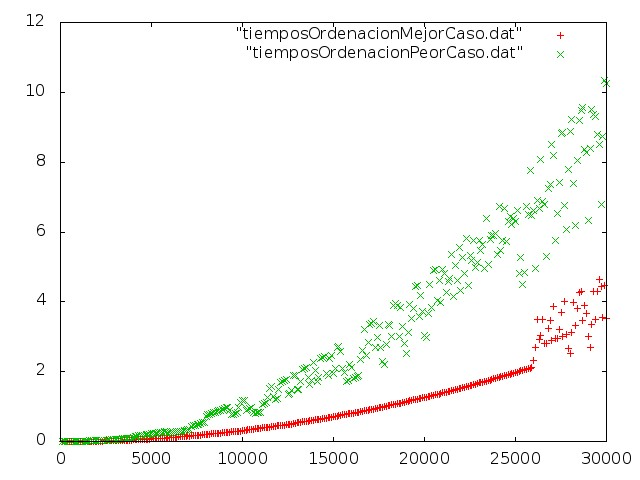
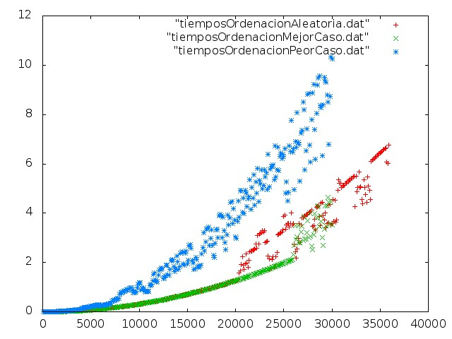

Informe de Eficiencia 4
-----------------------

###Algoritmo de ordenación Burbuja, ++Mejor y Peor Caso++

######Hardware Usado

El equipo donde se ha realizado la compilación y ejecución del programa es un Portatil Acer Aspire 5920 con las siguientes características:

* Procesador de doble núcleo: Intel(R) Core(TM)2 Duo CPU T5450 a 1.66GHz
* 4GB de Ram

######Sistema Operativo

Ubuntu 12.04.4 LTS  32 bits

######Compilador utilizado y opciónes de compilación

Se ha usado gcc versión 4.6.3 (Ubuntu/Linaro 4.6.3-1ubuntu5) 


######Desarrollo completo del cálculo de la eficiencia teórica y gráfica


Para calcular la eficiencia teórica realizamos el cálculo de las operaciones elementales que hay dentro del código principal del algoritmo de ordenación Burbuja.

```sh
void ordenar(int *v, int n){
	for(int i=0; i<n-1; i++)
    	for(int j=0; j<n-i-1; j++)
        	if(v[j]>v[j+1]){
            	int aux = v[j];
                v[j]=v[j+1];
                v[j+1]=aux;
            }
}
```
Haciendo el calculo de forma simplificada y quedandonos con el orden podemos decir que este algoritmo tiene una eficiencia de 0(n^2), cuadrática.

Para el cálculo de los tiempos ejecutamos el script ejecucionComparacion.sh que realiza todo el proceso para ver la comparativa. Compila las dos versiones del programa, ejecuta a su vez de forma controlada los script ejecucionesOrdenacionMejorCaso.csh y ./ejecucionesOrdenacionPeorCaso.csh que a su vez ejecutan los programas en bucle de forma controlada enviando los datos a unos ficheros .dat que luego son leidos por gnuplot mediante otro script para crear una gráfica como la que vemos abajo.

Todos los fuentes se encuentran disponibles aquí para sólo ser necesario bajarlos y ejecutar el .sh.




Si comparamos los resultados (mejor y peor caso) con los resultados obtenida en el caso medio para este algoritmo vemos que como esperábamos los resultados del caso aleatorio en la mayoría de los casos se alojan entre los peores y mejores. 



Vemos que conforme el número de elementos va creciendo la dispersión entre las muestras crece. Hubiera sido interesante poder ejecutar este script en un ordenador más potente y poder usar un mayor número de unidades. Aun así las diferencias son claras.


La última gráfica podemos obtenerla ejecutando en gnuplot:
```sh
set terminal jpeg
set output "graficaTriple.jpeg"
plot "tiemposOrdenacionAleatoria.dat","tiemposOrdenacionMejorCaso.dat","tiemposOrdenacionPeorCaso.dat"
```

