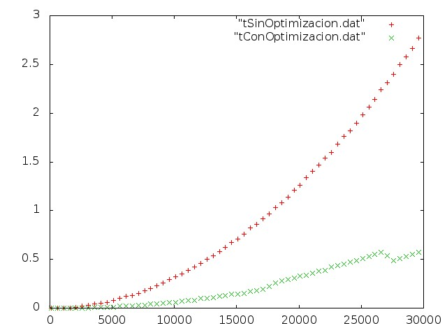

Influencia del proceso de compilación

Vamos a retomar el ejercicio donde tratamos el algoritmo de ordenación de la burbuja. Replicando el experimento esta vez compararemos los tiempos que se obtienen aplicando la optimización de mayor nivel del compilador, -O3.

Ejecutando el script que compila con y sin optimización y ejecutando ambas versiones del programa para vectores de tamaño de 100 a 30000 elemntos obtenemos la siguiente gráfica:

Vemos la enorme diferencia en el tiempo de ejecución incluso para los tamaños más grandes y la eficacia de la optimización que el propio compilador es capaz de hacer.
