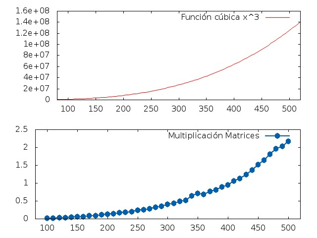
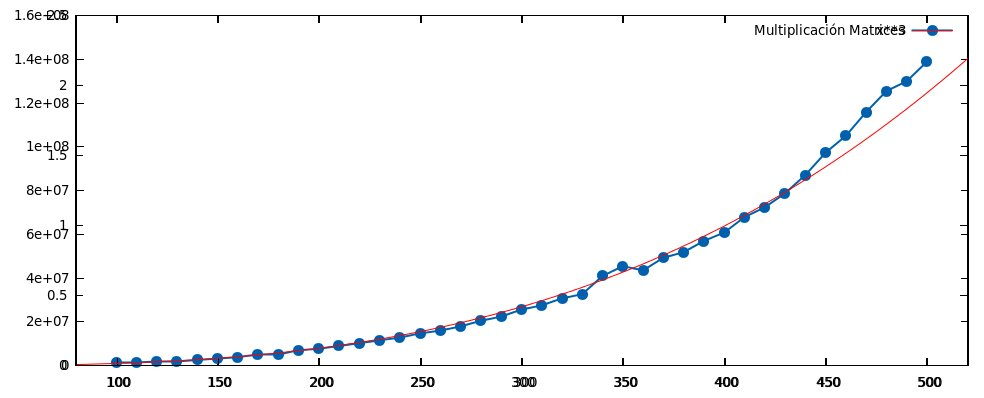

Informe de Eficiencia 7
-----------------------

###Algoritmo de Multiplicación de Matrices

######Hardware Usado

El equipo donde se ha realizado la compilación y ejecución del programa es un Portatil Acer Aspire 5920 con las siguientes características:

* Procesador de doble núcleo: Intel(R) Core(TM)2 Duo CPU T5450 a 1.66GHz
* 4GB de Ram

######Sistema Operativo

Ubuntu 12.04.4 LTS  32 bits

######Compilador utilizado y opciónes de compilación

Se ha usado gcc versión 4.6.3 (Ubuntu/Linaro 4.6.3-1ubuntu5) 


######Desarrollo completo del cálculo de la eficiencia teórica y gráfica


Para calcular la eficiencia teórica realizamos el cálculo de las operaciones elementales que hay dentro del código principal del sencillo algoritmo de multiplicación de matrices.

```sh
void multiplicaMatrices (int **matrizA, int **matrizB, int **matrizResultado, int tam){
  
for(int k=0; k<tam; k++)
  for(int i=0; i<tam; i++)
    for(int j=0; j<tam; j++)
      matrizResultado[k][i]+=matrizA[k][j]*matrizB[j][i];

}
```
Haciendo el calculo de forma simplificada y quedandonos con el orden al que pertenece podemos decir que este algoritmo tiene una eficiencia de 0(n^3), cúbica.

Más abajo podemos ver la forma en que crece la función cúbica x^3 y justo debajo como ha crecido el tiempo de ejecución de nuestro algoritmo en función del tamaño de la matriz (para ello hemos montado un pequeño script que agiliza el trabajo).




Ya se puede ver que los resultados empíricos se ajustan a los teóricos, es más, si superponemos ambas gráfcias aunque las escalas en el eje Y no son las mismas podemos ver como realmente la eficiencia teórica que le calculabamos a este algoritmo responde fielmente a la empírica, al menos en su mayor parte.





