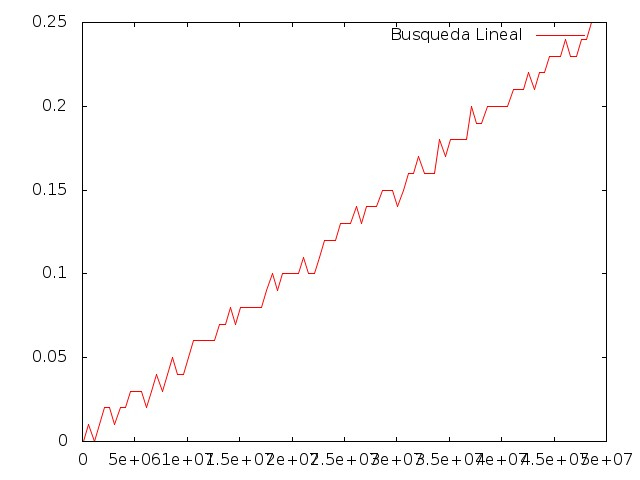
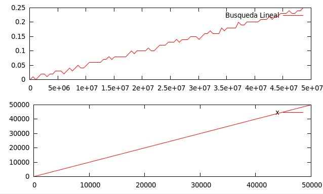

#Práctica 1: Eficiencia

En esta primera práctica trabajamos en la relación entre la eficiencia teórica y empírica. En primer lugar calculamos de forma manual la eficiencia teórica de un algoritmo, como el caso del alguritmo de ** Busqueda Lineal**.

```sh
int buscar(const int *v, int n, int x){
	int i=0;
    while (i<n && v[i]!=x)
    	i=i+1;
    if(i<n)
    	return i;
    else
    	return -1;
}
```
##Eficiencia teórica
En este caso calculando el número de operaciones elementales que realiza esta implementación obtenemos que tiempo de ejecución se puede formular con la siguiente ecuación: 

							T(n)=6n+7
que podemos resumir (quedándonos con la parte que relamente afecta a la función) diciendo que pertene a la familia de las T(n)=n o lo que es lo mismo, posee un orden de eficiencia de O(n), es decir, tiene un crecimiento lineal.

Este cálculo se ha realizado de forma simple en el peor de los casos, cuando el objeto nunca es encontrado, es decir, se recorre todo el vector en busca suya.

##Eficiencia empírica

Para calcular la eficiencia empírica implementamos el algoritmo en un .cpp y con la ayuda de las funciones de control de tiempo vemos el tiempo que tarda la ejecución del mismo. Este código puede verse en el fichero **busqueda_lineal.cpp**

Compilando y ejecutando el código podemos obtener el tiempo de ejecución para un tamaño del vector que le indiquemos. Entonces montamos un pequeño script para ejecutar este código para un número creciente de tamaño del vector. Este script en C Shell es **ejecuciones_blineal.csh**

Con este script también aprovechamos para poner los datos dentro de un fichero en un formato que gnuplot pueda leer correctamente.

Después con gnuplot cargamos los datos y obtenemos la gráfica de los resultados de los tiempos de la Búsqueda Lineal:



Si comparamos los resultados empíricos con los teóricos vemos que coinciden y que pese a los picos variables que los resultados de las ejecuciones nos pueden devolver la tendencia es la misma y dibuja una función lineal.



####Más:
Para


